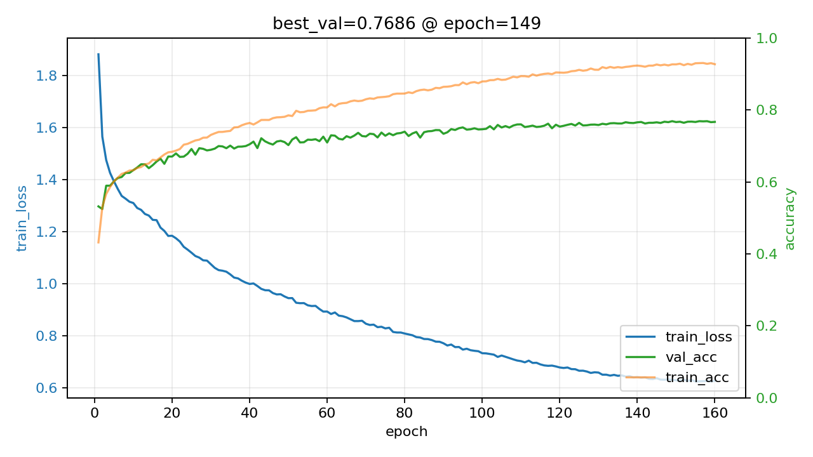
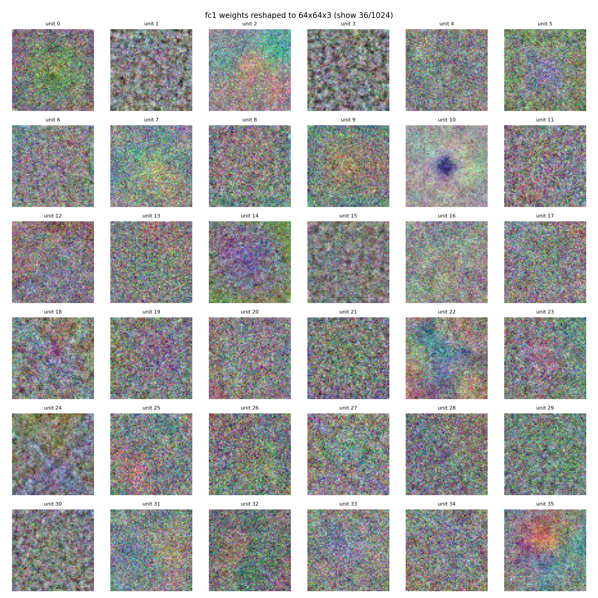

### 1. 任务与数据集

本作业在 EuroSAT_RGB 数据集上完成遥感土地覆盖分类任务。数据集包含 10 个类别：
AnnualCrop、Forest、HerbaceousVegetation、Highway、Industrial、Pasture、PermanentCrop、Residential、River、SeaLake。

### 2. 数据加载与预处理

- **读取与尺寸统一**：从 `EuroSAT_RGB/<class_name>/*.jpg` 读取图片，统一 resize 到 \(64\\times64\)，转为 RGB。
- **特征表示**：将图片像素归一化到 \([0,1]\)，并展平为长度 \(64\\times64\\times3=12288\) 的向量输入 MLP。
- **数据划分**：按类别分层划分训练/验证/测试集（默认 0.7/0.15/0.15），保证各类比例一致。
- **标准化**：基于训练集计算每个维度的 mean/std，对 train/val/test 做标准化 \(x'=(x-\\mu)/(\\sigma+10^{-6})\)。
- **训练数据增强（仅训练阶段）**：对 batch 内样本进行随机增强以提升泛化：
  - 随机水平/垂直翻转
  - 随机旋转（0/90/180/270 度）
  - 轻微颜色抖动（整体缩放+偏移）
  - 轻微高斯噪声

### 3. 模型结构（手工三层 MLP + 自动微分）

采用三层全连接 MLP 分类器（两层隐藏层，一层输出层），并在训练中支持可切换组件：

- **网络结构**：
  - Linear(12288 → 1024) → ReLU → LayerNorm → Dropout
  - Linear(1024 → 512) → ReLU → LayerNorm → Dropout
  - Linear(512 → 10) 输出 logits
- **正则化与稳定性**：
  - Dropout（训练时随机置零部分隐藏特征）
  - LayerNorm（对每个样本的隐藏特征做归一化，提升训练稳定性与泛化）
  - L2 正则（Weight Decay）
  - Label Smoothing（交叉熵标签平滑，缓解过拟合）
- **自动微分与反向传播**：
  - 自主实现 `Tensor` 计算图与 `backward()`，支持 `matmul/add/mul/sum/mean/exp/log/relu/tanh` 等算子；
  - 交叉熵（softmax + NLL）在 loss 中实现并回传 logits 梯度；
  - 训练阶段通过反向传播更新全部可学习参数。

### 4. 训练设置与模型保存

- **优化器**：SGD + Momentum（Nesterov），并加入 Weight Decay。
- **学习率策略**：OneCycle（warmup + 余弦退火），提升收敛速度。
- **模型选择**：每个 epoch 在验证集上评估准确率，自动保存 **val acc 最佳**的权重到 `checkpoints/best_single_strong.npz`。
- **训练曲线**：训练过程中记录并保存曲线图 `checkpoints/training_curve.png`（train loss、train acc、val acc）。

训练曲线如下图所示：



### 5. 第一层隐藏层权重可视化与讨论

将训练好的第一层权重矩阵 `fc1.W`（形状为 \(12288\\times1024\)）中每个隐藏单元对应的权重向量（长度 12288）恢复成 \(64\\times64\\times3\) 的图像尺寸：


部分权重图呈现出类似边缘/方向性纹理（例如条带、块状边界），这说明第一层已学到对局部结构变化敏感的线性模板；这类模板有助于区分具有显著几何结构的类别（如 高速公路、住宅区、工业区）。
部分权重图在某一颜色通道上更“亮”或更“暗”，意味着该隐藏单元对该颜色通道的响应更强/更弱；这对于区分具有明显颜色分布差异的类别（如 河流/海湖的水体颜色、森林的植被色调）是有帮助的。


### 6. 实验结果与分析

本次最佳结果（训练过程中自动保存的最佳验证集权重）如下：

- **Best val acc**：0.7686（epoch=149）
- **Test acc**：0.7699

并输出混淆矩阵：

```text
[[370   1   7  13   0   9  32   4  10   4]
 [  0 398   4   0   0  15   0   0   1  32]
 [ 16   1 301  23  16   8  55  18   9   3]
 [ 35   1  24 196  19  14  23  15  47   1]
 [  1   0   9  11 335   0   1  16   2   0]
 [  7  15  13   8   0 241   3   1   5   7]
 [ 40   0  37  21   8   8 240   6  15   0]
 [  1   0  28  12  27   2  17 354   8   1]
 [ 12   5   9  45   4   8   7   5 276   4]
 [  2  29   3   0   0   5   0   2   2 407]]
```


**易混淆类别与可能原因（结合地物特征）**：


- **AnnualCrop ↔ PermanentCrop / HerbaceousVegetation ↔ PermanentCrop（农作物/植被类型之间）**
  - 这几类在卫星视角下往往都表现为大面积连续区域，主差异可能来自**纹理细粒度（行列纹理、斑块尺度）**、**季节/生长阶段导致的颜色变化**以及田块边界形状。
  - 当图像块中田块纹理不明显、或颜色接近（例如都是偏绿/偏黄的植被色），MLP 更容易将其混为同一类。

- **Highway ↔ River（细长带状结构之间）**
  - 高速公路和河流都可能呈现**细长、连续、方向性强的带状结构**，且在 64×64 的小块中常只出现局部片段，缺少更大范围的上下文（例如道路互通、河网分叉）。
  - 部分河流在光照/浑浊度变化下可能偏灰/偏暗，和道路的灰色路面更接近，从而造成混淆。

- **Industrial ↔ Residential（建筑密集区之间）**
  - 工业区与住宅区都包含大量建筑物/道路，整体上表现为**高频纹理 + 人工几何结构**；区别往往依赖于更高层次的模式（如厂房屋顶形状更规则/更大、住宅区更细碎且道路网更密）。
  - 在较小视野内，如果只看到“建筑纹理”而缺少典型布局特征，容易互相误判。

- **Forest ↔ Pasture/HerbaceousVegetation（植被覆盖之间）**
  - 林地、牧场、草地都具有明显的绿色/植被纹理，但林地往往更“粗糙”、阴影更多；当分辨率和视角变化导致阴影/纹理差异不明显时，模型会更多依赖颜色，从而产生混淆。

总体而言，错误主要来自两点：一是部分类别在遥感视角下本身视觉差异细微（尤其农作物/植被类），二是图像块尺寸较小导致缺少更大尺度的上下文信息，使得“带状结构”（河流/道路）与“城市纹理”（工业/住宅）更容易出现局部相似。